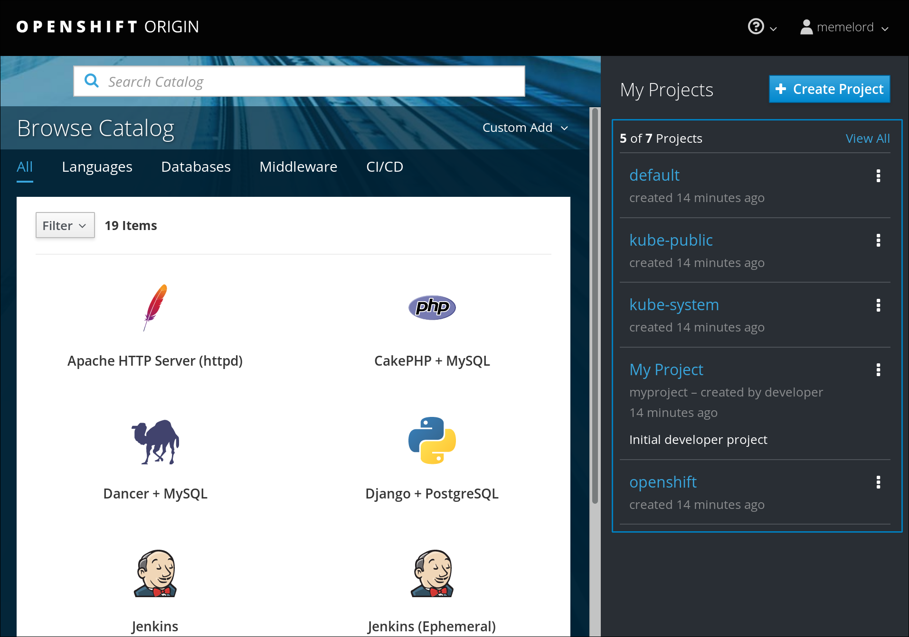

# Lab 05 : Install Openshift

> **Difficulty**: Medium

> **Time**: 15 minutes

> **Tasks**:
> - [Task 1: Install the OC binary](#task-1-install-the-oc-binary)
> - [Task 2: Start a cluster](#task-2-start-a-cluster)
> - [Task 3: Verify installation](#task-3-verify-installation)

## What is Openshift?

Naturally running and managing **multiple** containers and applications like we just did will get a bit tiresome, especially when you want to run production applications on them. That's why in the last years many companies have been frantically hammering out container solutions. See Google's GKE, Amazon's ECS, Red Hat's Openshift, Microsoft Azure's AKS...

We'll be playing with [Openshift Origin](https://www.openshift.org/). A Container Cluster Management program which itself can run in containers as well and is very easy to setup. Crudely put, it's built on top of Kubernetes and uses containers to run applications.

```
OpenShift Origin is a distribution of Kubernetes optimized for continuous application development and multi-tenant deployment. OpenShift adds developer and operations-centric tools on top of Kubernetes to enable rapid application development, easy deployment and scaling, and long-term lifecycle maintenance for small and large teams. 
```

## Task 0: Clean up docker

You probably have some containers running. Let's clean up Docker before we continue.

  ```
  docker stop $(docker ps -qa) && docker rm $(docker ps -qa) -f && docker rmi $(docker images -q) -f
  ```


## Task 1: Install the OC binary

First we'll install the binary so we can use Openshift from the commandline.

1. Download the binary.

  ```
  wget https://github.com/openshift/origin/releases/download/v3.7.1/openshift-origin-server-v3.7.1-ab0f056-linux-64bit.tar.gz
  ```
  
2. Extract the tar file.

  ```
  tar -xvf openshift*
  ```
  
3. Move the oc binary to a location which is already in your $PATH so you can call it from the commandline.

  ```
  mv openshift*/oc /bin/oc
  ```
  
4. Remove the tar file and folder.

  ```
  rm -rf openshift*
  ```
  
5. Make sure it works by asking for its version.

  ```
  oc version
  ```
  
  >oc v3.7.1+ab0f056
  >
  >kubernetes v1.7.6+a08f5eeb62
  >
  >features: Basic-Auth GSSAPI Kerberos SPNEGO
  

## Task 2: Start a cluster

Next we'll start the containerized cluster. We'll have to specify the public DNS name (which has already been set up on AWS for you) so Openshift doesn't just work locally but remotely as well.

1. Set an environment variable, **make sure to fill in <YOUR_ID>**.

  ```
  export public_hostname="instanceteam<YOUR_ID>.workshop.gluo.cloud"
  ```
  
2. Start your Openshift cluster!

  ```
  oc cluster up --public-hostname="${public_hostname}" --routing-suffix="${public_hostname}"
  ```


## Task 3: Verify installation

1. Look at all the images that were pulled to create containers

  ```
  docker images
  ```
  
2. Look at all the containers that were set up to form the Openshift cluster

  ```
  docker ps
  ```
  
  ```
  docker ps --format "table {{.ID}}\t{{.Names}}"
  ```

3. Log in as the system administrator, this is only possible when directly logged onto the Openshift master instance.

  ```
  oc whoami
  ```

  ```
  oc login -u system:admin
  ```

4. Give the user with whom we'll login privileges. (You can choose any name.)

  ```
  oc adm policy add-cluster-role-to-user cluster-admin <YOUR_NAME>
  ```

5. View the cluster status, copy the server hostname and visit it with your browser. 
  NOTE: You'll have to accept some security exceptions since we're working with self-signed certificates!
  
  ```
  oc cluster status
  ```

6. Go to `https://instanceteam<YOUR_ID>.workshop.gluo.cloud:8443` and login with <YOUR_NAME>.
  NOTE: It is possible to log in to the site with any credentials since access control isn't enabled. Please use <YOUR_NAME> again so you have the permissions we added earlier.
  
7. If everything goes as expected you should bee greeted with a lovely browser interface with administrator projects on the right side (indicating you've correctly assigned permissions).
  
  


## Update scoring
Run `checkscore` once your reach this task to update your scoring for this lab!  

  
## Conclusion

Congratulations, You have successfully completed this lab! You learned how to install Openshift and log in via the CLI and via the web.

Continue to the next lab. ([Next lab](../Lab%206%20-%20Create%20an%20Openshift%20application))