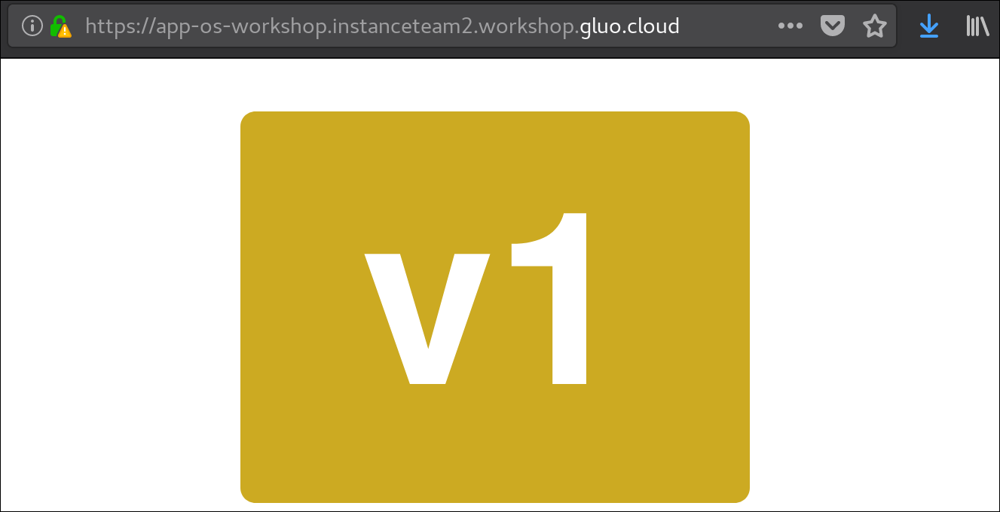
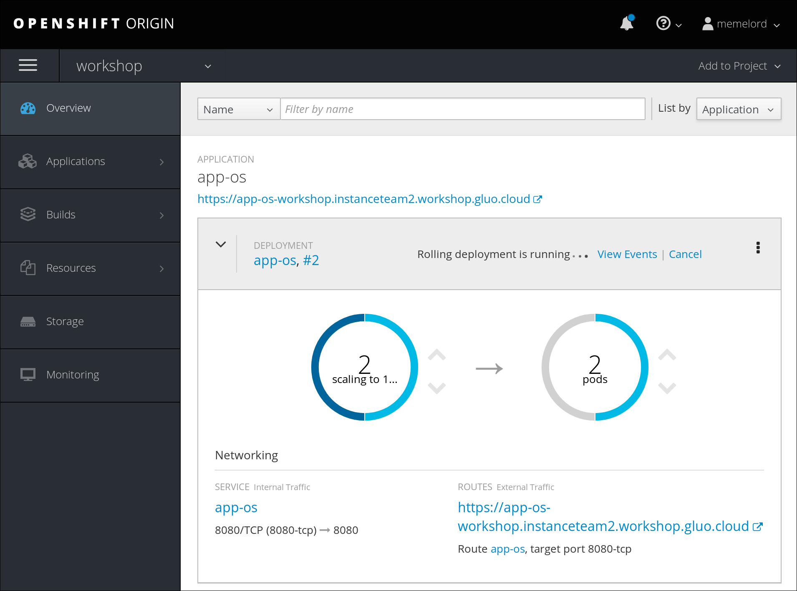
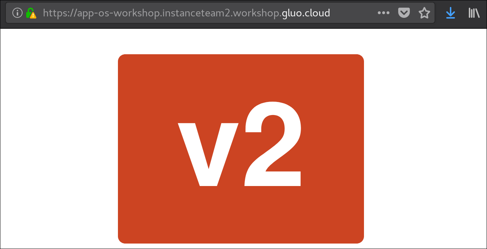

# Lab 06 : Using Openshift

> **Difficulty**: Medium

> **Time**: 30-40 minutes

> **Tasks**:
> - [Task 1: Create a project](#task-1-create-a-project)
> - [Task 2: Create an application](#task-2-create-an-application)
> - [Task 3: Expose the application](#task-3-expose-the-application)
> - [Task 4: Enable https](#task-4-enable-https)
> - [Task 5: Scale your application](#task-5-scale-your-application)
> - [Task 6: Versioning](#task-6-versioning)
> - [Task 7: Rollback](#task-7-rollback)
> - [Task 8: Logging](#task-8-logging)
> - [Task 9: Pod shell access](#task-9-pod-shell-access)
> - [Task 10: Deploy from source](#task-10-deploy-from-source)
> - [Task 11: Templates](#task-11-templates)


## Projects

Projects are a top level concept to help you organize your deployments. An OpenShift project allows a community of users (or a user) to organize and manage their content in isolation from other communities. 

Some projects have been created already. These house 

Projects act as a "wrapper" around all the application services and endpoints you or your teams are using for your work. For this first lab, we are going to use a project named **myproject** that has been created automatically.

  `oc new-project newproject`
  `oc project`
  `oc projects`
  `oc get project` 


## Containers and pods

Before we start digging in we need to understand how containers and Pods are related. In OpenShift, the smallest deployable unit is a Pod. A Pod is a group of one or more Docker containers deployed together and guaranteed to be on the same host. 

Each pod has its own IP address, therefore owning its entire port space, and containers within pods can share storage. Pods can be "tagged" with one or more labels, which are then used to select and manage groups of pods in a single operation.

  `oc get pods`
  `oc describe pod <pod>`


## Services

Services provide a convenient abstraction layer inside OpenShift to find a group of Pods. They also act as an internal proxy/load balancer between those Pods and anything else that needs to access them from inside the OpenShift environment. 

When you ask OpenShift to run an image, it automatically creates a Service for you. Remember that services are an internal construct. They are not available to the "outside world" by default but exposing the service by creating a route will make it available.

  `oc get svc`
  `oc describe svc <svc>`
  `oc expose svc <svc>`
  
  
## Endpoints

Services are linked to pods via endpoints. Each pod receives a unique IP within the OpenShift environment. Listing the endpoints is a quick way to see how many pods are behind a service.

  `oc get endpoints`
  
  
## Routes

While Services provide internal abstraction and load balancing within an OpenShift environment, sometimes clients outside of OpenShift need to access an application. The way that external clients are able to access applications running in OpenShift is through the OpenShift routing layer. And the data object behind that is a Route.

An OpenShift route is a way to expose a service by giving it an externally-reachable hostname like www.example.com. Routes use HTTP unless otherwise specified. You can optionally define security, such as TLS, for the Route. 

  `oc get routes`

  
## Replication Controller

While Services provide routing and load balancing for Pods, which may go in and out of existence, ReplicationControllers (RC) are used to specify and then ensure the desired number of Pods (replicas) are in existence. For example, if you always want your application server to be scaled to 3 Pods (instances), a ReplicationController is needed. Without an RC, any Pods that are killed or somehow die/exit are not automatically restarted. ReplicationControllers are how OpenShift "self heals".

  `oc get rc`
  `oc describe rc <rc>`


## Deployment Configuration

In the simplest case, a deployment just creates a new replication controller and lets it start up pods. However, OpenShift Container Platform deployments also provide the ability to transition from an existing deployment of an image to a new one and also define hooks to be run before or after creating the replication controller.

  `oc get dc`
  `oc describe dc <dc>`
  `oc scale <dc> --replicas=3`
  `oc rollback <dc>`
  

## Image Streams

A deployment's image connection with repositories, external or internal. An image stream comprises one or more Docker images identified by tags. OpenShift components such as builds and deployments can watch an image stream to receive notifications when new images are added and react by performing a build or a deployment.

  `oc get imagestream`
  `oc tag <new_image_name> <project/imagestream_with_initial_tag>`


## Task 1: Create a project

Being logged in to the Openshift master instance allows us to log in as the system administrator. Let's log in and create a new project.

1. Log in as the system administrator.

  `oc login -u system:admin`

  `oc whoami`

2. Create a new project called `workshop`. You'll automatically switch to that new project.

  `oc new-project workshop`

3. List all projects and view a project's status

  `oc projects`
  
  `oc get project`


## Task 2: Create an application

1. Create a new application by specifying your docker repository image and tag.
  NOTE: It is possible to use your own Docker hub registry image but unfortunately it does not natively work with Openshift. A filled in .json template is needed for the application to work properly. The app-os image is modified to work with Openshift.

  `oc new-app leynebe/app-os:v1`

2. Go to your browser and switch to the `workshop` project.

3. In the Overview of your project you'll find your application is running but no public link is available to your app. This means your app is not exposed to the outside world by default. This is where routes come in.

4. (Optional) Please do look around the Openshift GUI of your project or even other projects.


## Task 3: Expose the application

1. Create a route for the service that's linked to our application pod.
  
  `oc expose svc app-os`

2. List all routes of this project.

  `oc get routes`
  
3. Go to your browser and into your workshop project. An **http** link should have appeared, click it. The webpage should display the `v1` tag in the color `beige`.

  


## Task 4: Enable https

If our application hosted sensitive data we'd be exposing it to the outside world unencrypted. There are several TLS options which can be enabled like edge, passthrough and re-encryption. For now we'll implement the edge terminated route which gives our Openshift Router the task to secure the route. This is very simple to do.

1. Set the default editor for the Openshift binary. Choose between `vi`, `vim`, `emacs`, `nano`, make sure your chosen option is installed.

  `export OC_EDITOR=<choice>`

1. Edit the existing route we created by exposing the service.

  `oc edit route app-os`
  
2. Add `tls:` as a child of `spec:`, then add `termination: edge` as a child of `tls:`. It should look something like the following:

  ```
  ...
  spec:
    tls:
      termination: edge
    ...
  ...
  ```

3. Save and quit.

4. The clickable link in your openshift application page should now be **https**. You'll have to add another exception to your browser for it to work.

  


## Task 5: Scale your application

Sometimes one container just isn't enough. Scale your application by adding more replications of your one pod. The service will automatically load balance between the pods when traffic arrives to access our application.
Scaling pods up or down is done by calling the Deployment Configuration (DC) with the oc command (or via the browser interface). The Replication Controller (RC) will be called by the DC and will make sure the pod/container count is scaled up or down. The difference between DC and RC is very subtle, but basically DC manages the RC and RC manages the pod count.

1. Get info on the DC and RC. For now we're on revision 1 and have 1 pod.

  `oc get dc`
  
  ```
  NAME      REVISION   DESIRED   CURRENT   TRIGGERED BY
  app-os    1          1         1         config,image(app-os:v1)
  ```
  
  `oc get rc`
  
  ```
  NAME       DESIRED   CURRENT   READY     AGE
  app-os-1   1         1         1         11m
  ```

2. Scale the application and immediately watch the pods.

  `oc scale dc/app-os --replicas=2`

3. If you quickly go back to the Openshift application page you'll see we're upscaling to 2 pods. You can also use the Openshift browser interface to easily scale up and down with the up and down arrows instead of using commands.

  

4. Check out DC and RC changes. We're still on revision one (using the :v1 image) but we've upscaled to 2 pods.

  `oc get dc`
  
  ```
  NAME      REVISION   DESIRED   CURRENT   TRIGGERED BY
  app-os    1          2         2         config,image(app-os:v1)
  ```
  
  `oc get rc`
  
  ```
  NAME       DESIRED   CURRENT   READY     AGE
  app-os-1   2         2         2         26m
  ```


## Task 6: Versioning

We can deploy another version of our application by tagging the Image Stream (IS) with another image. The IS is a combination of the <IMAGE> and <TAG> you used when you created the application with `oc new-app`. Let's deploy version 2 of our application by tagging the IS with `leynebe/app-os:v2`.

1. Get the <IMAGE> and <TAG> name by looking at the image stream. It should be `app-os` and `v1` and the image stream name will stay like that.

  `oc get is`
  
  ```
  NAME      DOCKER REPO                        TAGS      UPDATED
  app-os    172.30.1.1:5000/myproject/app-os   v1        28 minutes ago
  ```

2. Tag the imagestream with an image from the Docker Hub with another tag.

  `oc tag docker.io/leynebe/app-os:v2 workshop/app-os:v1`

3. Quickly look at the Openshift Application page to see the deployment downscale the v1 pods and upscale the v2 pods.

  

4. Look at the application itself to see it displays a `red` `v2` now. (Hard refresh might be necessary CTRL/CMD+SHIFT+R)

  

4. Try out other versions v3 and v4

  `oc tag docker.io/leynebe/app-os:v3 workshop/app-os:v1`
  
  `oc tag docker.io/leynebe/app-os:v4 workshop/app-os:v1`
  
5. Check out DC and RC changes.

  `oc get dc`
  
  ```
  NAME      REVISION   DESIRED   CURRENT   TRIGGERED BY
  app-os    2          2         2         config,image(app-os:v1)
  ```
  
  `oc get rc`
  
  ```
  NAME       DESIRED   CURRENT   READY     AGE
  app-os-1   0         0         0         32m
  app-os-2   2         2         2         2m
  ```


## Task 7: Rollback

Not content with a new deployment? Roll back your previous deployment by using the `oc rollback` command on our application.

1. Roll back to a previous deployment

  `oc rollback app-os`

2. Refresh the page. (Hard refresh might be necessary CTRL/CMD+SHIFT+R)
  
3. Or roll back to a named deployment

  `oc rollback app-os-1`
  
4. Refresh the page. (Hard refresh might be necessary CTRL/CMD+SHIFT+R)


## Task 8: Logging

It's not possible for the base CLI commands to display as much information as in the browser interface, but we can view any resource's data and logs by using these simple commands.

1. Using `oc edit` we can edit any resource instantly. We can also just output the resource settings to the screen in different formats like YAML or JSON.

  `oc get dc app-os -o yaml`

  `oc get rc app-os -o json`

  `oc get pods`
  
  `oc get pod <pod_name> -o yaml`

2. Get the logs of any pod to troubleshoot issues with `oc logs <pod_name>`.

  `oc logs <pod_name>`


## Task 9: Pod shell access

Easily accessible logs not enough for you? Just like `docker exec` we can access any pod/container by using `oc rsh`.

1. Enter a pod.

  `oc get pods`

  `oc rsh <pod_name>`

2. Print its index.html page contents.  

  `cat /usr/share/nginx/html/index.html`
  
  
## Task 10: Deploy from source

Openshift is able to deploy containers directly from the source code on Github itself (using Source To Image or S2I).

1. Create a new php application.

  `oc new-app https://github.com/openshift/cakephp-ex.git`

2. Click the created route for the new application.

You can find many more examples by browsing the catalog from the browser interface when in a project by pressing `Add to Project` and `Browse Catalog`.


## Task 11: Templates

Using this YAML or JSON we can define templates which we then use to create certain resources. Imagine having to deploy 100 application with minor changes via the web browser... This is made a million times easier using templating.

  `oc create -f <template.yaml>`
  
1. Git clone this repository to get the yaml files located in this lab to your instance.

    `git clone https://github.com/gluobe/container-workshop-pxl ~/docker-openshift-repo` 

2. Execute every one of them in this order with the following commands:

    `oc create -f project.yaml`
    
    `oc create -f pod.yaml -n hello-openshift-project`    
    
    `oc create -f service.yaml -n hello-openshift-project`    
    
    `oc create -f route.yaml -n hello-openshift-project`   
    
3. Go to your project named `hello-openshift-project` in your browser and visit the application via the route.


## Update scoring
Run `checkscore` once your reach this task to update your scoring for this lab!  

  
## Conclusion

Congratulations, You have successfully completed this lab! You learned some basic Container Management concepts and how to work with Openshift via the commandline.

Continue to the next lab. ([Next lab](../Lab%207%20-%20Rejoin%20a%20cluster))